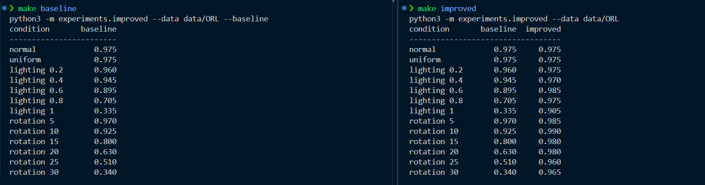

# LBP Face Recognition — Robust to Lighting and Rotation

A small face recogniser based on **Local Binary Patterns (LBP)**. It works well on
normal photos, and this project makes it keep working when **the lighting changes
across the face** and when **the face is rotated**.

## What the recogniser does

A photo is a grid of pixels. For every pixel, the recogniser looks at the 8 pixels
around it and asks: *is this neighbour brighter or darker than me?* That gives a short
8-bit code, a little "signature" of that spot (an edge, a line, or a flat area). The
face is split into a grid of windows, each window counts how often every signature
appears, and all those counts together form a **fingerprint of the face**. To identify
someone, the new fingerprint is compared with the stored ones and the closest match
wins.

On normal photos this is about **97.5%** correct.

## The two problems

| Problem | What happens | Baseline accuracy |
|---|---|---|
| One side of the face is lit much more strongly | The "brighter/darker" answer flips on the dark side, so the signatures change | **0.705** |
| The face is rotated 20° | The ring of neighbours turns, shifting each signature, so it looks like a different code | **0.630** |

## The two fixes

**1. Evening out the lighting.**
Before building the signatures, divide the photo by its own **blurry copy**. The blur
captures the smooth bright-to-dark glow, so dividing cancels it, while the fine face
detail stays. It's like a phone camera's auto-brightness, applied to every part of the
face.

**2. Turning the faces while learning them.**
When storing a known face, also store copies turned a little (every 5°, from −30° to
+30°). A turned photo can then match the turned copy that lines up with it — like
keeping passport photos of a friend facing straight, slightly left, and slightly right.

## Results

| Condition | Baseline | Improved |
|---|---:|---:|
| Normal | 0.975 | 0.975 |
| Uniform brightness | 0.975 | 0.975 |
| Lighting ramp 0.2 | 0.960 | 0.975 |
| Lighting ramp 0.4 | 0.945 | 0.970 |
| Lighting ramp 0.6 | 0.895 | 0.985 |
| **Lighting ramp 0.8** | **0.705** | **0.975** |
| Lighting ramp 1.0 | 0.335 | 0.905 |
| Rotation 5° | 0.970 | 0.985 |
| Rotation 10° | 0.925 | 0.990 |
| Rotation 15° | 0.800 | 0.980 |
| **Rotation 20°** | **0.630** | **0.980** |
| Rotation 25° | 0.510 | 0.960 |
| Rotation 30° | 0.340 | 0.965 |

Normal accuracy is unchanged; the hard cases become almost as good as the easy ones.



## How to run

```bash
# one-time: create the environment and install dependencies
python3 -m venv .venv
.venv/bin/python -m pip install -r requirements-dev.txt

# the ORL images must be in data/ORL/ (see "Getting the data" below)

make baseline PY=.venv/bin/python    # baseline table only
make improved PY=.venv/bin/python    # baseline vs improved
```

## Getting the data

Download the ORL database (the original 92×112 `.pgm` files) and lay it out as
`data/ORL/s1/1.pgm` … `data/ORL/s40/10.pgm`. It is not bundled here. A canonical
source is the Cambridge page:
<https://www.cl.cam.ac.uk/research/dtg/attarchive/pub/data/att_faces.zip>

## Files

| Path | What it is |
|---|---|
| `lbpface/` | the recogniser (LBP operator, histograms, distances, classification) |
| `experiments/improved.py` | the two fixes + the lighting/rotation evaluation |
| `lbpface/preprocess.py` | `normalize_illumination` — the lighting fix |
| `workshop.tex` | write-up with the explanation and the results table (for Overleaf) |
| `results/baseline.md`, `results/improved.md` | the result tables in markdown |
| `Makefile` | `make baseline`, `make improved`, `make test`, … |
